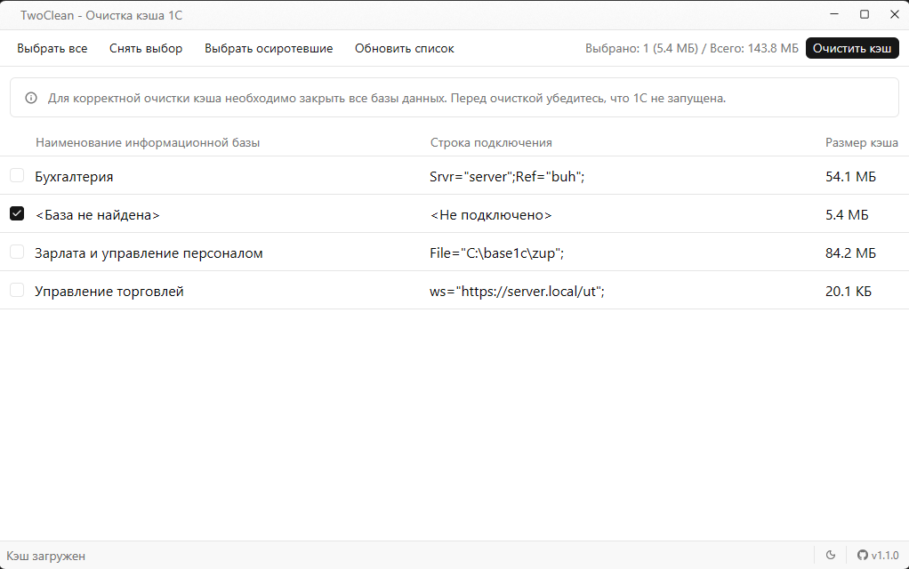
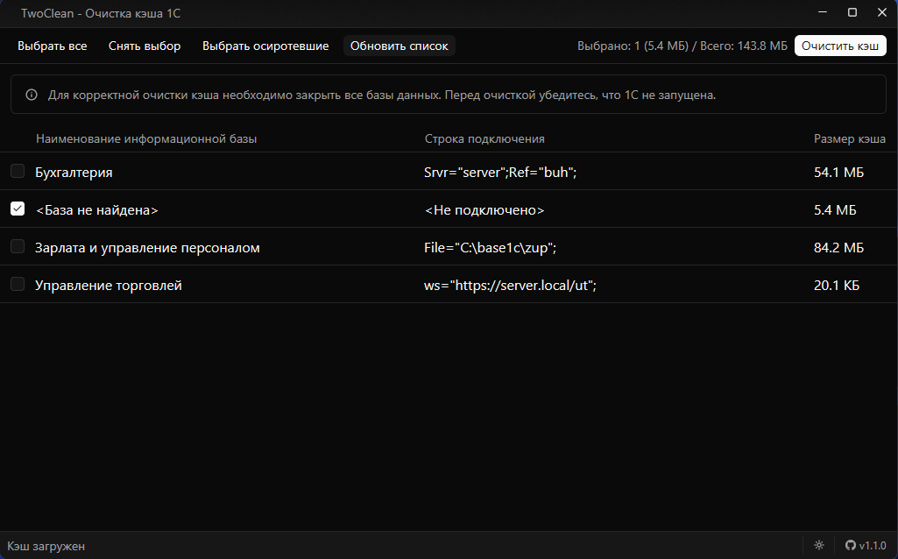

#  TwoClean

### Быстрая очистка локального кэша 1С:Предприятие в Windows

  <strong>Найти устаревший кэш. Выбрать базы. Очистить.</strong>

  &nbsp;&nbsp;&nbsp;&nbsp;&nbsp;&nbsp;

  <a href="https://github.com/llitaket88/TwoClean/issues">Issues</a>
  ·
  <a href="https://github.com/llitaket88/TwoClean/releases">Releases</a>
  ·
  <a href="https://github.com/llitaket88/TwoClean/pulls">Pull Requests</a>

---

## О TwoClean

**TwoClean** - небольшая Windows-утилита для очистки локального кэша **1С:Предприятие**.

Программа позволяет выбрать нужные информационные базы для очистки, а также обнаружить **осиротевшие каталоги кэша** - остатки от баз, которые больше не используются.

> Не требует установки, работает локально и не отправляет пользовательские данные в сеть. Только проверяет наличие новой версии при каждом запуске.

## Возможности

- 🗂️ **Выбор баз** - очистка кэша конкретных информационных баз.
- 🔎 **Поиск осиротевших каталогов** - обнаружение кэша баз, которых больше нет в текущем списке.
- ☑️ **Выборочная очистка** - перед удалением можно выбрать нужные элементы.
- ⚡ **Минимум действий** - запустил, выбрал, очистил.
- 🔒 **Локальная работа** - сетевое подключение для работы программы не требуется.
- ⚠️ **Проверка активности** - необходимо закрыть все базы 1С:Предприятие.
- 🔆 **Светлая и темная темы** - определение системной темы с возможностю переключения.
- 👍 **Автообновление** - автоматическая проверка наличия новой версии программы.

## Скриншоты

<table>
  <tr>
    <td align="center">
      
    </td>
    <td align="center">
      
    </td>
  </tr>
  <tr>
    <td align="center">Светлая тема</td>
    <td align="center">Тёмная тема</td>
  </tr>
</table>

## Быстрый старт

1. Откройте раздел [Releases](https://github.com/llitaket88/TwoClean/releases).
2. Скачайте последний `.exe`.
3. Запустите `TwoClean.exe`.
4. Выберите базы или осиротевшие каталоги.
5. Выполните очистку.

**Установка не требуется.**

## Системные требования

| Требование  | Значение        |
| ----------- | --------------- |
| ОС          | Windows 10 / 11 |
| Архитектура | x64             |
| Установка   | Не требуется    |
| Интернет    | Не требуется    |

## Безопасность и приватность

TwoClean работает локально на компьютере пользователя.

- Данные информационных баз не отправляются на внешние серверы.
- Для работы приложения подключение к интернету не требуется.
- Программа не требует отдельного сервера или облачного сервиса.
- Удаляются только выбранные пользователем элементы.

> Перед очисткой необходимо закрыть запущенные экземпляры **1С:Предприятия**, использующие соответствующий кэш.

## Технологии

- **[Rust](https://www.rust-lang.org/)** - основной язык разработки.
- **[GPUI](https://www.gpui.rs/)** / **[gpui-kit](https://gpui-kit.com/)** - графический интерфейс.

## Проект

TwoClean - форк проекта **[OneCleaner](https://github.com/vbondarevsky/OneCleaner)** с более узким набором функций.

Проект развивается в первую очередь для практического применения и одновременно является учебным проектом для изучения **Rust** и **GPUI**.

### Использование ИИ

В процессе разработки использовались ИИ-ассистенты:

- **[Claude](https://claude.ai/)** - Anthropic
- **[ChatGPT](https://chatgpt.com/)** - OpenAI

ИИ использовался как инструмент разработки: для анализа, поиска решений, рефакторинга и работы с документацией.

## Участие

Буду рад обратной связи и contributions.

- 🐛 Нашли ошибку? Создайте [issue](https://github.com/llitaket88/TwoClean/issues).
- 💡 Есть идея или предложение? Создайте [issue](https://github.com/llitaket88/TwoClean/issues).
- 🔧 Хотите внести изменения? Откройте [pull request](https://github.com/llitaket88/TwoClean/pulls).
- ⭐ Нравится проект? Поставьте [звезду](https://github.com/llitaket88/TwoClean/stargazers).

Новичкам в Rust тоже рады - проект подходит для изучения языка на практике.

---

**TwoClean**

Сделано с ❤️ на Rust

